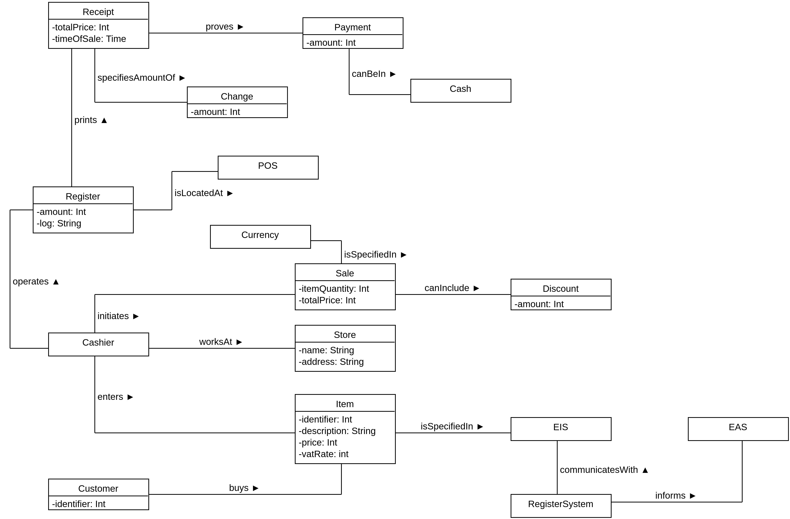
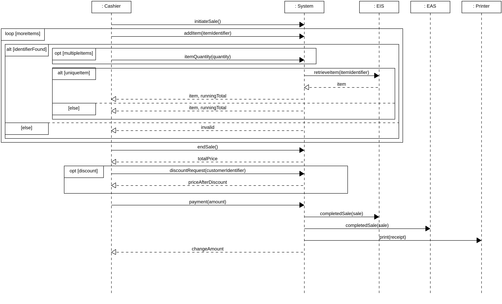

# Seminar 1
**Object-Oriented Design, IV1350**

Daniel Gustafsson

danielg8@kth.se

31/3 - 21

## Introduction
The given task is to use UML modeling tools to create a domain model and a system seequence diagram of a retail store. 
The retail store flow including alternative flows are specified in the task requirements.

I have collaborated with Valerio Akman when solving these tasks.

## Method

### Domain Model (Task 1)
I begun by identifying all key nouns from the Requirements Specification.

**Key Nouns**:
- POS
- RetailStore
- Customer
- Goods
- Item
- Cashier
- Sale
- ItemIdentifier
- Program
- Price
- VATRate
- ItemDescription
- ExternalInventorySystem (EIS)
- TotalPrice
- Payment
- AmountPaid
- ExternalAccountingSystem (EAS)
- RegisterAmount
- Receipt
- Change
- Discount
- CustomerIdentifier
- DateOfSale
- TimeOfSale
- StoreName
- StoreAddress
- SaleLog

Following that I used a category list to try and find some other useful classes.

**Categories**:

| Category     | Items           |
|--------------|-----------------|
| Transactions | Payment, Sale |
| Products, Services | Goods |
| Roles, People, Organizations| Customer, Cashier, Store |
| Places | Store, POS |
| Records | Receipt, EIS, EAS, RegisterLog |
| Events | Sale, DiscountRequest |
| Physical Objects | Goods, Receipt, Cash, Register, Store, Cart |
| Devices | Register |
| Descriptions | PriceTag, ItemDescription, CustomerIdentifier, ItemIdentifier |
| Systems | EIS, EAS, RegisterSystem |
| Quantities, Units | ItemQuantity, ItemPrice, TotalPrice, VATRate, Discount, Change, Currency, RegisterAmount, AmountPaid |

When all classes where found I removed classes which didn't fit into the model.

**Removing irrelevant classes**:
- Cart, never mentioned in the specification and seems irrelevant.
- PriceTag, same as ItemPrice.
- Program, same as RegisterSystem.
- SaleLog, same as RegisterLog.
- Price, same as ItemPrice.
- RetailStore, same as Store.
- Goods, same as Item.
- DateOfSale, exists within TimeOfSale.

Here I changed some classes to be attributes of other classes instead, further removing uneccesary classes. I thought that a class that is only associated with one or two other classes and can be represented by either an Integer, String or Boolean, could be an attribute. **I also used common sense**.

**Changing classes to attributes**:
- ItemIdentifier, -> item attribute.
- ItemPrice, -> item attribute.
- VATRate, -> item attribute.
- ItemDescription, -> item attribute.
- CustomerIdentifier, -> customer attribute.
- RegisterAmount, -> register attribute.
- RegisterLog, -> register attribute.
- StoreName, -> store attribute.
- StoreAddress, -> store attribute.
- TimeOfSale, -> receipt attribute.
- AmountPaid, -> payment attribute.
- ItemQuantity, -> sale attribute.
- TotalPrice, -> receipt & sale attribute.

When deciding associations, I tried to find associations that weren't obvious from the requirement specification but still made sense in the context.

### System Sequence Diagram (Task 2)

When developing the SSD I followed the requirement specification and added all steps that included a message between the system and an external agent (cashier, EIS etc). I later added the alternative flows.

## Result

### Domain Model (Task 1)

The UML-diagram below represents the finished domain model based on the given requirement specification. Each box represents a class and each line represents an association.

### System Sequence Diagram (Task 2)

The UML-diagram below represents the finished SSD based on the given requirement specification. The flow is mainly between the Cashier and the System (register) but the System also messages a few other external systems. Some parts of the flow is in loops and some are in alternative or optional blocks.

## Discussion

I am satisfied with my results. The domain model could have had more associations but I had to stop somewhere. I think the SSD is quite messy because of all the alternative flows in step 3/4 but this is the requirements faults and not my own.