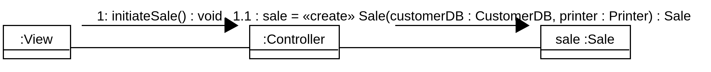
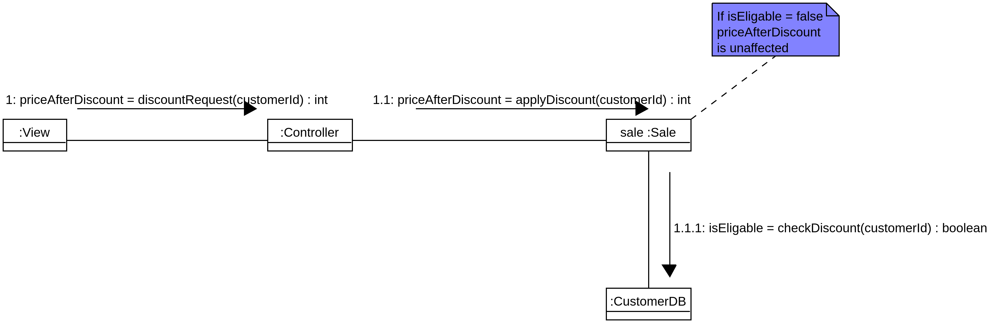
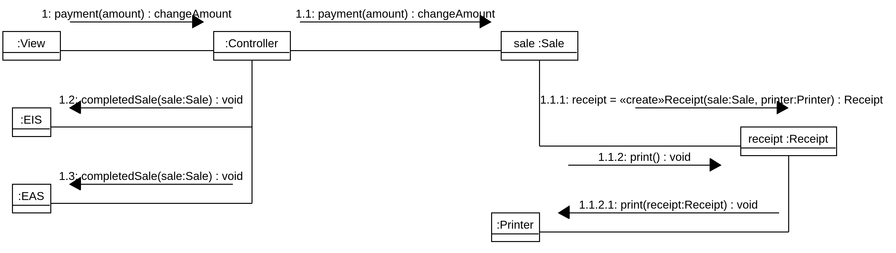

# Seminar 2
**Object-Oriented Design, IV1350**

Daniel Gustafsson

danielg8@kth.se

22/4 - 21

## Introduction
The given task is to design a program using class and interaction diagrams. The program should be able to handle all parts of the *Process Sale* scenario, including alternative flows.

I collaborated with Valerio Akman when solving this task.
## Method
When designing the program we begun with creating all classes we thought we would need in the class diagram and sorting them into packages. We followed the MVC and layer patterns as far as possible. 

We followed our *system sequence diagram* from seminar 1 when deciding on which classes where needed, furthermore we found a few additional classes where needed like *CustomerDB*. 

Checking if a customer was eligable for a discount was handled solely by the *System* class in the *SSD*, this would not be proficient in the program design, this is why the *CustomerDB* class was created, a database where customer data is stored and discount-eligability can be checked.

In the *SSD* *addItem* and *itemQuantity* where 2 separate methods, this wasn't elegant enough for our program so they were combined so that *addItem* now takes 2 arguments instead (itemID and quantity).

The main method uses C-syntax because thats cooler than Java.

## Result
### Class Diagram

This diagram includes all classes and methods of the program, the view and integration layers are abstracted to "just work".

### Communication Diagrams

This diagram represents the communication between classes when *initiateSale()* is called.

The controller gets the *Item* object from the *External Inventory System*, that is why the *Item* class is in the *Integration* package.

The *endSale* method is very similar to the *initiateSale* method, the only difference is that in *endSale*, a int *totalPrice* is returned.

This is where the *CustomerDB* class is used, to check if a customer is eligable for a discount.

When the customer pays the sale, a receipt is printed and the external systems are updated.

The *Main* class is responsible for starting up the program and initializing all subsystems.

## Discussion
I believe the design is very easy to understand and that all patterns and conventions are followed. 

In my opinion, most of the assessment criteria are very subjective, who can decide if a design has "enough classes", "low coupling" or "high cohesion"? I believe my design is nice and I don't believe It could be eaten with "köttfärssås" (It's not spaghetti).

I also think that it **would** have been eaqualy as correct to use C++ or any other object-oriented programming languages naming convention and don't understand why I had to use specifically Java.

Overall very good report and design.